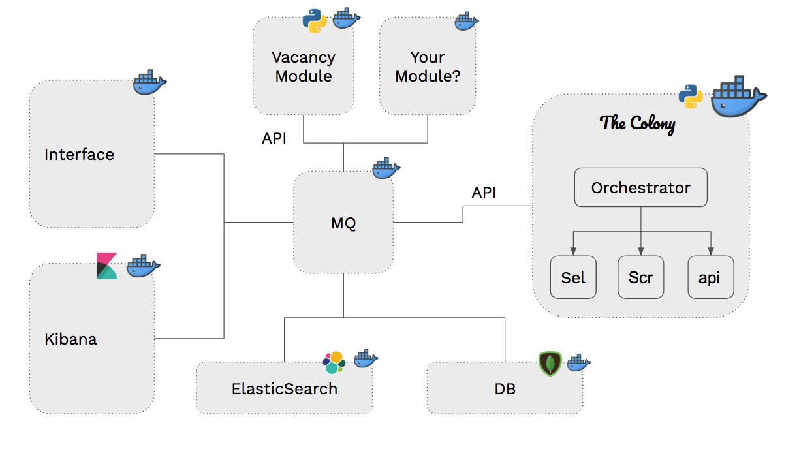

<h1 align="center">
  
</h1>
<h2 align="center">
</h2>

### Overview

### Infra & Services

#### The Colony : workers app

##### Resources
###### 1. Selenium grid
Image used: [Docker-Selenium Grid](https://github.com/SeleniumHQ/docker-selenium)

###### 2. Scrapy
[website](https://scrapy.org/)

###### 3. Standalone dom request library
[Python Requests](https://2.python-requests.org/en/master/)\
[Python Html Requests](https://html.python-requests.org/)

### Containers:
| name of container         | needed for |
| ------------------      | ----------     |
| `worker-app`   | The app and API for the scraping microservice |
| `selenium-hub` | Selenium Hub for selenium Grid, this will distribute any incoming requests over the available chrome noded |
| `chrome-node`  | A headless chrome node for general web-scraping needing javascript related tasks |
| `chrome-debug` | A debugging node, this container has a VNC server built in, you can view it with your vnc viewer of choice (Mac has a built in one, named Screen Sharing) you can connect to it using `localhost:5900`. PW is `secret`. (Not yet usable for production env, as it exposes ports with weak password)  |

#### Additional Containers
| name of container         | needed for |
| ------------------      | ----------     |
| `elasticSearch`   | Can index the received vacancy data (works only with scrapy for now) |
| `Kibana` | Dashboard for metrics on the vacancy data |

##### Issue: why Scrapy doesn't work yet
Scrapy uses its own asynchronous threads (reactor) and needs to operate outside the flask env.

### Requirements & Setup

1. Docker

Install [wiki](https://gitlab.ycdev.nl/yaleesa/project-monarch/wikis/1.-Install---services)

### Roadmap

#### ToDo
1. Choose a pub/sub and knit everything together.
2. Spin up an actual database (mongodb)
3. Interface
